# FastAPI with Multi-Provider LLM Integration

A modern FastAPI application with PostgreSQL database integration, multiple LLM provider support (Ollama, Anthropic, OpenAI, Google), comprehensive API endpoints, and a user-friendly Streamlit frontend.


## Table of Contents

- [Project Structure](#project-structure)
- [Features](#features)
- [Architecture](#architecture)
- [Requirements](#requirements)
- [Installation](#installation)
- [Setting Up Ollama](#setting-up-ollama)
- [Running the Application](#running-the-application)
- [Testing](#testing)
- [API Endpoints](#api-endpoints)
- [Using the Chat Endpoint](#using-the-chat-endpoint)
- [Managing System Prompts](#managing-system-prompts)
- [Streamlit User Interface](#streamlit-user-interface)
- [Extending the Application](#extending-the-application)
- [API Documentation](#api-documentation)
- [Database Schema](#database-schema)
- [Data Migration](#data-migration)
- [Troubleshooting](#troubleshooting)
- [License](#license)
- [Acknowledgements](#acknowledgements)

## Project Structure

```
.
├── src/                 # Backend source code
│   ├── main.py          # Main FastAPI application entry point
│   └── utils/           # Utility modules
│       ├── provider/    # LLM provider implementations
│       │   ├── __init__.py
│       │   └── ollama.py # Ollama provider implementation
│       ├── models/       # Data models
│       │   ├── api_models.py # Pydantic models for API
│       │   └── db_models.py  # SQLAlchemy database models
│       ├── repository/  # Database repository pattern
│       │   ├── base.py  # Base repository
│       │   ├── chat_repository.py
│       │   ├── message_repository.py
│       │   ├── system_prompt_repository.py
│       │   ├── user_repository.py
│       │   └── rate_limit_repository.py
│       ├── __init__.py
│       ├── auth.py      # Authentication logic
│       ├── chat_interface_db.py # Database-backed chat interface
│       ├── config.py    # Configuration management
│       ├── database.py  # Database connection and session
│       ├── health.py    # Health check functionality
│       ├── migration.py # Database migration utilities
│       └── system_prompt_db.py # Database-backed system prompt management
├── tests/               # Test suite
│   ├── __init__.py
│   ├── conftest.py      # Shared test fixtures and configuration
│   ├── unit/            # Unit tests for isolated components
│   ├── integration/     # Integration tests for component interactions
│   └── api/             # API endpoint tests
├── docs/                # Documentation
│   ├── README.md        # Documentation index
│   ├── testing-strategy.md # Comprehensive testing approach
│   ├── testing-quickstart.md # Quick start guide for testing
│   └── multi-provider-integration-plan.md # Plan for multiple LLM providers
├── sql/                 # Database SQL scripts
│   ├── 01_schema.sql    # Database schema definition
│   ├── 02_seed_data.sql # Initial seed data
│   ├── setup.sql        # Master setup script
│   └── docker-init.sh   # Docker initialization script
├── streamlit/           # Streamlit frontend application
│   ├── app.py           # Main Streamlit application
│   ├── modules/         # Modular components
│   │   ├── chat.py      # Chat interface module
│   │   ├── prompts.py   # System prompt management module
│   │   └── sidebar.py   # Sidebar navigation module
│   └── run.sh           # Startup script for Streamlit
├── chats/               # Legacy directory for file-based chat history
├── system_prompts/      # Legacy directory for file-based system prompts
├── requirements.fastapi.txt # Python dependencies for FastAPI backend
├── requirements.streamlit.txt # Python dependencies for Streamlit frontend
├── requirements.test.txt # Python dependencies for testing
├── pytest.ini           # Pytest configuration
├── Dockerfile.fastapi   # Docker configuration for FastAPI backend
├── Dockerfile.streamlit # Docker configuration for Streamlit frontend
├── docker-compose.yml   # Docker Compose for running all services
├── .env.example         # Example environment configuration
└── README.md            # Documentation
```

## Features

- 🚀 **Modern FastAPI Framework**: High-performance, easy to learn, fast to code
- 🐘 **PostgreSQL Database**: Robust relational database for data persistence
- 🔄 **Health Check Endpoint**: Monitor application and provider status
- 🔐 **Database-Backed Authentication**: Secure endpoints with user management and API keys
- 🛡️ **Rate Limiting**: Database-tracked rate limiting per user
- ✅ **Input Validation**: Comprehensive validation of all user inputs
- 🤖 **Multi-Provider LLM Support**: Seamlessly switch between Ollama, Anthropic, OpenAI, and Google
- 🔌 **Provider Management**: Dynamic provider selection with database configuration
- 📊 **Usage Tracking**: Monitor token usage and costs per provider/model
- 💾 **Scalable Data Storage**: PostgreSQL database with proper indexing
- 👥 **Multi-User Support**: Each user has isolated chat sessions
- 🆔 **Custom Chat IDs**: Use your own identifiers for conversation tracking
- 🧵 **Multiple Chat Sessions**: Support for multiple chat threads per user
- 📝 **Customizable System Prompt**: Define LLM behavior with database persistence
- 📚 **System Prompt Library**: Create, edit, and manage multiple system prompts
- 🗑️ **Chat Management**: Delete unwanted conversation histories
- 🖥️ **Streamlit Web UI**: Modern, intuitive user interface with dark mode
- 🧩 **Modular Architecture**: Clean separation of concerns with repository pattern
- 🐳 **Docker Support**: Complete containerization with PostgreSQL included
- 🔄 **Automatic Migration**: Seamless migration from file-based to database storage
- 🧪 **Comprehensive Testing**: Unit, integration, and API tests with pytest framework

## Architecture

The application follows a modular architecture with multi-provider LLM support:

```mermaid
graph TB
    subgraph "Frontend Layer"
        UI[Streamlit UI]
        UI_Chat[Chat Module]
        UI_Prompts[Prompts Module]
        UI_Sidebar[Sidebar Module]
        
        UI --> UI_Chat
        UI --> UI_Prompts
        UI --> UI_Sidebar
    end
    
    subgraph "API Layer"
        FastAPI[FastAPI Application]
        Auth[Authentication<br/>Middleware]
        RateLimit[Rate Limiting<br/>Middleware]
        
        FastAPI --> Auth
        FastAPI --> RateLimit
    end
    
    subgraph "Business Logic Layer"
        ChatInterface[Chat Interface]
        SystemPromptMgr[System Prompt<br/>Manager]
        ProviderMgr[Provider<br/>Manager]
        
        subgraph "LLM Providers"
            BaseProvider[Base Provider<br/>Interface]
            Ollama[Ollama<br/>Provider]
            Anthropic[Anthropic<br/>Provider]
            OpenAI[OpenAI<br/>Provider]
            Google[Google<br/>Provider]
        end
        
        ChatInterface --> ProviderMgr
        ProviderMgr --> BaseProvider
        BaseProvider --> Ollama
        BaseProvider --> Anthropic
        BaseProvider --> OpenAI
        BaseProvider --> Google
    end
    
    subgraph "Data Access Layer"
        UserRepo[User<br/>Repository]
        ChatRepo[Chat<br/>Repository]
        MessageRepo[Message<br/>Repository]
        PromptRepo[System Prompt<br/>Repository]
        RateLimitRepo[Rate Limit<br/>Repository]
        ProviderRepo[Provider<br/>Repository]
        UsageRepo[Usage<br/>Repository]
    end
    
    subgraph "Database Layer"
        PostgreSQL[(PostgreSQL)]
        Users[Users Table]
        Chats[Chats Table]
        Messages[Messages Table]
        SystemPrompts[System Prompts<br/>Table]
        RateLimits[Rate Limits<br/>Table]
        ProviderConfigs[Provider Configs<br/>Table]
        ProviderModels[Provider Models<br/>Table]
        ProviderUsage[Provider Usage<br/>Table]
        
        PostgreSQL --> Users
        PostgreSQL --> Chats
        PostgreSQL --> Messages
        PostgreSQL --> SystemPrompts
        PostgreSQL --> RateLimits
        PostgreSQL --> ProviderConfigs
        PostgreSQL --> ProviderModels
        PostgreSQL --> ProviderUsage
    end
    
    subgraph "External Services"
        OllamaService[Ollama Service<br/>:11434]
        AnthropicAPI[Anthropic API]
        OpenAIAPI[OpenAI API]
        GoogleAPI[Google API]
    end
    
    %% Connections
    UI_Chat --> |HTTP/API Key| FastAPI
    UI_Prompts --> |HTTP/API Key| FastAPI
    UI_Sidebar --> |HTTP/API Key| FastAPI
    
    FastAPI --> ChatInterface
    FastAPI --> SystemPromptMgr
    FastAPI --> ProviderMgr
    
    ChatInterface --> ChatRepo
    ChatInterface --> MessageRepo
    SystemPromptMgr --> PromptRepo
    Auth --> UserRepo
    RateLimit --> RateLimitRepo
    ProviderMgr --> ProviderRepo
    ProviderMgr --> UsageRepo
    
    UserRepo --> PostgreSQL
    ChatRepo --> PostgreSQL
    MessageRepo --> PostgreSQL
    PromptRepo --> PostgreSQL
    RateLimitRepo --> PostgreSQL
    ProviderRepo --> PostgreSQL
    UsageRepo --> PostgreSQL
    
    Ollama --> |HTTP| OllamaService
    Anthropic --> |HTTPS| AnthropicAPI
    OpenAI --> |HTTPS| OpenAIAPI
    Google --> |HTTPS| GoogleAPI
    
    %% Styling
    classDef frontend fill:#e1f5fe,stroke:#01579b,stroke-width:2px,color:#000
    classDef api fill:#f3e5f5,stroke:#4a148c,stroke-width:2px,color:#000
    classDef business fill:#e8f5e9,stroke:#1b5e20,stroke-width:2px,color:#000
    classDef provider fill:#c8e6c9,stroke:#388e3c,stroke-width:2px,color:#000
    classDef data fill:#fff3e0,stroke:#e65100,stroke-width:2px,color:#000
    classDef database fill:#fce4ec,stroke:#880e4f,stroke-width:2px,color:#000
    classDef external fill:#f5f5f5,stroke:#424242,stroke-width:2px,color:#000
    
    class UI,UI_Chat,UI_Prompts,UI_Sidebar frontend
    class FastAPI,Auth,RateLimit api
    class ChatInterface,SystemPromptMgr,ProviderMgr business
    class BaseProvider,Ollama,Anthropic,OpenAI,Google provider
    class UserRepo,ChatRepo,MessageRepo,PromptRepo,RateLimitRepo,ProviderRepo,UsageRepo data
    class PostgreSQL,Users,Chats,Messages,SystemPrompts,RateLimits,ProviderConfigs,ProviderModels,ProviderUsage database
    class OllamaService,AnthropicAPI,OpenAIAPI,GoogleAPI external
```



### Architecture Components:

1. **Database Layer**: PostgreSQL database with SQLAlchemy ORM
   - Core tables: Users, Chats, Messages, System Prompts, Rate Limits
   - Provider tables: Provider Configs, Provider Models, Provider Usage
   - Repository pattern for clean data access
   - Connection pooling for performance
   
2. **Authentication Layer**: Database-backed user and API key management
   - Support for multiple users with isolated data
   - API key generation and validation
   - Rate limiting per user
   
3. **Provider Management Layer**: Multi-provider LLM support
   - **Provider Manager**: Central orchestrator for all LLM providers
   - **Base Provider Interface**: Standardized API for all providers
   - **Provider Implementations**: Ollama, Anthropic, OpenAI, Google
   - **Dynamic Configuration**: Database-backed provider settings
   - **Usage Tracking**: Monitor tokens and costs per provider/model
   
4. **Chat Interface**: Core module that handles conversations
   - Database persistence for all conversations
   - Multi-provider support with dynamic selection
   - User isolation and access control
   - Provider/model tracking per message
   
5. **System Prompt Manager**: Database-backed prompt library
   - Create, update, delete, and activate prompts
   - Per-user prompt customization
   - Default prompts for quick start
   
6. **API Layer**: FastAPI routes with dependency injection
   - Provider management endpoints
   - Chat endpoints with provider selection
   - System prompt management
   - Health checks for all providers
   
7. **Streamlit UI**: Modular frontend with provider selection
   - Real-time chat interface with model selection
   - Provider and model management
   - System prompt management
   - Session navigation

## Requirements

- Python 3.13+
- PostgreSQL 15+
- [Ollama](https://ollama.ai/download) (if using the Ollama provider)
- FastAPI & Uvicorn (backend)
- Streamlit (frontend)

## Installation

### Backend Dependencies

```bash
pip install -r requirements.fastapi.txt
```

### Frontend Dependencies

```bash
pip install -r requirements.streamlit.txt
```

### Testing Dependencies (Optional)

```bash
pip install -r requirements.test.txt
```

### Configuration

Create a `.env` file in the project root:

```env
# API Security
API_KEY=your-secure-api-key-here

# Rate Limiting
RATE_LIMIT_PER_HOUR=1000

# Database Configuration
DB_HOST=localhost
DB_PORT=5432
DB_NAME=postgres
DB_USER=streamlitdemo
DB_PASSWORD=streamlitdemo

# Provider API Keys (optional, only needed for specific providers)
ANTHROPIC_API_KEY=your-anthropic-api-key
OPENAI_API_KEY=your-openai-api-key
GOOGLE_API_KEY=your-google-api-key

# Legacy File Paths (for migration)
CHAT_HISTORY_DIR=chats
SYSTEM_PROMPT_FILE=system_prompt.txt
SYSTEM_PROMPTS_DIR=system_prompts
```

### Database Setup

1. **Local PostgreSQL Setup**:
   ```bash
   # Create database and user
   createuser -U postgres streamlitdemo
   createdb -U postgres postgres
   
   # Run the schema setup
   psql -U streamlitdemo -d postgres -f sql/setup.sql
   ```

2. **Using Docker** (recommended):
   The PostgreSQL database will be automatically initialized when using docker-compose.

## Setting Up Ollama

1. Install Ollama from [ollama.ai/download](https://ollama.ai/download)
2. Start the Ollama service
3. Pull the required model:
   ```bash
   ollama pull llama3.1:8b-instruct-q8_0
   ```

## Running the Application

### Local Development

#### Backend

```bash
uvicorn src.main:app --reload
```

The API will be available at http://127.0.0.1:8000

#### Frontend

```bash
cd streamlit
chmod +x run.sh
./run.sh
```

The Streamlit UI will be available at http://127.0.0.1:8501

### Using Docker Compose

Docker Compose will automatically start PostgreSQL, FastAPI, and Streamlit:

```bash
# Using .env file (recommended)
docker-compose up

# Or with environment variables
export API_KEY=your-secure-api-key-here
docker-compose up
```

Services will be available at:
- FastAPI backend: http://localhost:8000
- Streamlit frontend: http://localhost:8501
- PostgreSQL database: localhost:5432

The database will be automatically initialized with the schema and seed data on first run.

## Testing

The application includes a comprehensive test suite using pytest for ensuring code quality and reliability.

### Test Structure

```
tests/
├── conftest.py          # Shared fixtures and test configuration
├── unit/                # Unit tests for isolated components
├── integration/         # Integration tests for component interactions
└── api/                 # API endpoint tests
```

### Installing Test Dependencies

```bash
pip install -r requirements.test.txt
```

### Running Tests

```bash
# Run all tests
pytest

# Run tests with verbose output
pytest -v

# Run only unit tests
pytest -m unit

# Run tests with coverage report
pytest --cov=src --cov-report=html

# Run specific test file
pytest tests/unit/test_models.py

# Run tests in parallel (requires pytest-xdist)
pytest -n auto
```

### Test Configuration

The test configuration is defined in `pytest.ini`:
- Automatic async test discovery and execution
- Test markers for categorizing tests (unit, integration, api)
- Configured to handle asyncio properly

### Writing Tests

Example test structure:

```python
# tests/unit/test_example.py
import pytest
from src.utils.models.api_models import ChatRequest

class TestChatRequest:
    def test_valid_message(self):
        request = ChatRequest(message="Hello!")
        assert request.message == "Hello!"
    
    @pytest.mark.asyncio
    async def test_async_operation(self):
        # Test async functions with pytest.mark.asyncio
        result = await some_async_function()
        assert result is not None
```

### Test Coverage

To generate and view coverage reports:

```bash
# Generate HTML coverage report
pytest --cov=src --cov-report=html

# View coverage report
open htmlcov/index.html  # macOS
xdg-open htmlcov/index.html  # Linux
```

### Continuous Integration

The test suite is designed to run in CI/CD pipelines. Tests are organized by speed:
- Unit tests: Fast, isolated tests that run first
- Integration tests: Tests that interact with the database
- API tests: Full endpoint tests with authentication

### Testing Best Practices

1. **Isolation**: Each test should be independent and not affect others
2. **Fixtures**: Use pytest fixtures for reusable test data and setup
3. **Mocking**: Mock external services (like LLM providers) to avoid API calls
4. **Database**: Tests use transactions that rollback to keep the test database clean
5. **Async**: Use `@pytest.mark.asyncio` for async test functions

For more detailed testing documentation, see:
- [Testing Strategy](docs/testing-strategy.md) - Comprehensive testing approach
- [Testing Quick Start](docs/testing-quickstart.md) - Get started with testing quickly
- [Testing AI Providers](docs/testing-ai-providers.md) - Testing LLM provider integrations

## API Endpoints

All endpoints except `/` and `/health` require authentication with an API key in the header:
`Authorization: Bearer <API_KEY>`

The application has the following endpoints:

### Root and Health

1. `GET /` - Returns API information and available endpoints (no auth required)
2. `GET /health` - Returns the health status of the API (no auth required)

### Chat Endpoints

3. `POST /chat` - Chat with the LLM using the configured provider
   
   Request:
   ```json
   {
     "message": "Tell me a fun fact about space",
     "chat_id": "optional-chat-id-for-continuing-conversation",
     "provider": "ollama",  // optional, defaults to user's default
     "model": "llama3.1:8b-instruct-q8_0"  // optional, defaults to provider's default
   }
   ```

4. `GET /chat/history` - Get a summary of all chat histories
5. `GET /chat/history/{chat_id}` - Get the complete history for a specific chat
6. `DELETE /chat/delete/{chat_id}` - Delete a specific chat history

### System Prompt Endpoints

7. `GET /system-prompt` - Get the current active system prompt
8. `POST /system-prompt` - Update the active system prompt
   
   Request:
   ```json
   {
     "prompt": "Your new system prompt text"
   }
   ```

9. `GET /system-prompts` - Get all system prompts in the library
10. `POST /system-prompts` - Create a new system prompt
    
    Request:
    ```json
    {
      "name": "Prompt name",
      "content": "Prompt content",
      "description": "Optional description"
    }
    ```

11. `GET /system-prompts/{prompt_id}` - Get a specific system prompt by ID
12. `PUT /system-prompts/{prompt_id}` - Update a specific system prompt
13. `DELETE /system-prompts/{prompt_id}` - Delete a specific system prompt
14. `POST /system-prompts/{prompt_id}/activate` - Set a specific system prompt as the active one

### Provider Management Endpoints

15. `GET /providers` - Get all available providers and their status
16. `GET /providers/{provider}/models` - Get available models for a specific provider
17. `GET /providers/{provider}/health` - Check health status of a specific provider

## Using the Chat Endpoint

### Starting a New Conversation

Send a POST request without a chat_id to start a new conversation:

```bash
curl -X POST http://localhost:8000/chat \
  -H "Authorization: Bearer your-api-key-here" \
  -H "Content-Type: application/json" \
  -d '{"message": "Tell me a fun fact about space"}'
```

### Continuing a Conversation

Use the chat_id returned from a previous request to continue the conversation:

```bash
curl -X POST http://localhost:8000/chat \
  -H "Authorization: Bearer your-api-key-here" \
  -H "Content-Type: application/json" \
  -d '{"message": "Tell me more about stars", "chat_id": "space-facts"}'
```

### Using Different Providers and Models

Specify a provider and model to use a specific LLM:

```bash
curl -X POST http://localhost:8000/chat \
  -H "Authorization: Bearer your-api-key-here" \
  -H "Content-Type: application/json" \
  -d '{
    "message": "Write a haiku about technology",
    "provider": "anthropic",
    "model": "claude-4-opus-20250114"
  }'
```

## Managing System Prompts

### Get Active System Prompt

```bash
curl -X GET http://localhost:8000/system-prompt \
  -H "Authorization: Bearer your-api-key-here"
```

### Set Active System Prompt

```bash
curl -X POST http://localhost:8000/system-prompt \
  -H "Authorization: Bearer your-api-key-here" \
  -H "Content-Type: application/json" \
  -d '{"prompt": "You are a helpful assistant..."}'
```

### Create a New System Prompt

```bash
curl -X POST http://localhost:8000/system-prompts \
  -H "Authorization: Bearer your-api-key-here" \
  -H "Content-Type: application/json" \
  -d '{
    "name": "Customer Support",
    "content": "You are a customer support agent...",
    "description": "Prompt for handling customer inquiries"
  }'
```

### Activate a System Prompt from Library

```bash
curl -X POST http://localhost:8000/system-prompts/customer-support/activate \
  -H "Authorization: Bearer your-api-key-here"
```

## Managing Providers

### List Available Providers

```bash
curl -X GET http://localhost:8000/providers \
  -H "Authorization: Bearer your-api-key-here"
```

### Get Models for a Provider

```bash
curl -X GET http://localhost:8000/providers/ollama/models \
  -H "Authorization: Bearer your-api-key-here"
```

### Check Provider Health

```bash
curl -X GET http://localhost:8000/providers/ollama/health \
  -H "Authorization: Bearer your-api-key-here"
```

## Streamlit User Interface

The project includes a modern Streamlit-based web interface organized into modules for better maintainability:

### Features

- **Modular Architecture**: Separated into chat, prompts, and sidebar modules
- **Dark Mode**: Elegant dark theme with customizable appearance
- **Chat Interface**: User-friendly chat interface with message history
- **Multi-Provider Support**: Select from available LLM providers and models
- **System Prompt Management**: Create, edit, delete, and activate system prompts
- **Session Management**: Switch between different chat sessions
- **Provider Monitoring**: View provider status and available models
- **Responsive Design**: Optimized for different screen sizes

### Using the Streamlit UI

1. **Chat Tab**: Main conversation interface
   - Enter session ID (optional) or start without one
   - Select provider and model from available options
   - View conversation history with provider/model indicators
   - Send messages and receive responses
   - Clear or delete conversations

2. **System Prompts Tab**: Manage LLM behavior
   - View prompt library
   - Create new prompts
   - Edit existing prompts
   - Activate prompts to change AI behavior
   - Delete custom prompts

3. **Sidebar**: Navigation and settings
   - Toggle dark mode
   - Create new chat sessions
   - Switch between existing sessions
   - View and edit active system prompt
   - Monitor provider status
   - View available models per provider

## Extending the Application

### Adding New LLM Providers

The system is designed to be easily extended with new LLM providers:

1. Create a new provider class in `src/utils/provider/` that inherits from `BaseProvider`
2. Implement required methods: `chat_completion`, `list_models`, `health_check`
3. Register the provider in `ProviderManager._provider_classes`
4. Add provider configuration to the database seed data
5. Set the appropriate API key in your `.env` file

Example provider implementation:
```python
from utils.provider.base import BaseProvider, ChatResponse

class NewProvider(BaseProvider):
    async def chat_completion(self, messages, model, **kwargs) -> ChatResponse:
        # Implement API call to your provider
        pass
```

### Extending the Streamlit UI

The modular Streamlit interface can be extended by:

1. Adding new modules in `streamlit/modules/`
2. Implementing new tabs in `app.py`
3. Customizing the appearance through the CSS section

## API Documentation

Interactive API documentation is available at:

- Swagger UI: http://127.0.0.1:8000/docs
- ReDoc: http://127.0.0.1:8000/redoc

## Database Schema

The application uses the following database tables:

### Core Tables
- **users**: User accounts with API key management
- **chats**: Chat sessions linked to users, with provider/model tracking
- **messages**: Individual messages within chats, with provider/model per message
- **system_prompts**: Library of system prompts
- **rate_limits**: Tracking API usage for rate limiting

### Provider Tables
- **provider_configs**: Configuration for each LLM provider
- **provider_models**: Available models for each provider
- **provider_usage**: Token usage and cost tracking per provider/model

## Data Migration

The application automatically migrates existing file-based data to PostgreSQL on startup:

1. **System Prompts**: Migrated from `system_prompts/` directory
2. **Chat History**: Migrated from `chats/` directory
3. **Active System Prompt**: Migrated from `system_prompt.txt`

All migrated data is associated with an anonymous user. After migration, users can create accounts for isolated data access.

## Troubleshooting

### Database Connection Issues

If you encounter database connection errors:

1. Verify PostgreSQL is running: `pg_isready -h localhost -p 5432`
2. Check credentials in `.env` file match your PostgreSQL setup
3. Ensure the database exists: `psql -U streamlitdemo -l`
4. For Docker users, check container status: `docker ps`

### Provider Issues

#### Ollama Provider
1. Ensure the Ollama service is running (`ps aux | grep ollama`)
2. Verify you have pulled the required model (`ollama list`)
3. Check for firewall issues blocking access to the Ollama server (port 11434)

#### API-based Providers (Anthropic, OpenAI, Google)
1. Verify API keys are set correctly in `.env` file
2. Check API key permissions and quotas
3. Ensure network connectivity to provider APIs
4. Monitor rate limits and usage quotas
5. Check provider status pages for service interruptions

### Frontend-Backend Connection

If the Streamlit frontend cannot connect to the FastAPI backend:

1. Verify the API_URL environment variable is set correctly
2. Ensure the backend is running and accessible
3. Check that the API_KEY in `.env` is set for both services
4. Check network connectivity between services if using Docker

### Authentication Errors

If you get 401 Unauthorized errors:

1. Check the API_KEY in your `.env` file
2. Ensure Streamlit has loaded the `.env` file (restart if needed)
3. Verify the Bearer token format in API requests
4. Check if the user's API key exists in the database

## License

This project is licensed under the MIT License - see the LICENSE file for details.

## Acknowledgements

- [FastAPI](https://fastapi.tiangolo.com/) for the high-performance API framework
- [Streamlit](https://streamlit.io/) for the intuitive UI framework
- [Ollama](https://ollama.ai/) for providing local LLM capabilities
