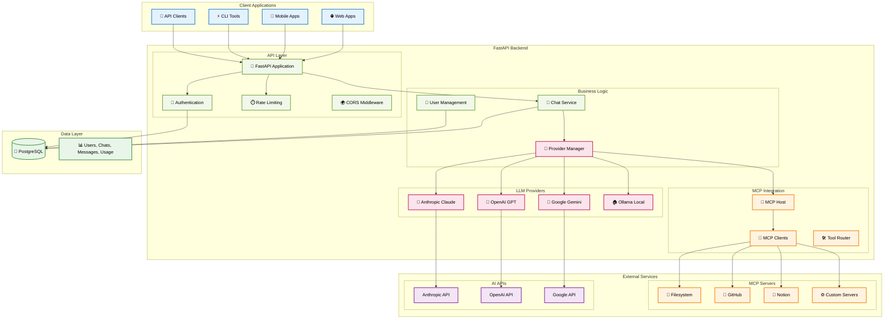

# FastAPI Multi-Provider LLM Platform with MCP Integration

[](https://www.python.org/downloads/)
[](https://fastapi.tiangolo.com/)
[](https://www.postgresql.org/)
[](https://www.gnu.org/licenses/gpl-3.0)
[](http://makeapullrequest.com)

A production-ready FastAPI backend featuring native Model Context Protocol (MCP) support, multi-provider LLM integration, PostgreSQL database, and comprehensive REST API endpoints.

<p align="center">
  
  &nbsp;&nbsp;&nbsp;&nbsp;
  
</p>

## 🚀 Key Features

### 🔌 Native MCP (Model Context Protocol) Integration
- **"The USB-C of AI Applications"**: Standardized tool calling across all LLM providers
- **Always-On Tools**: MCP tools automatically available without special configuration
- **Multi-Tool Chaining**: Complex workflows with automatic error recovery
- **Tool Execution Visibility**: Complete transparency showing all tool executions
- **Multiple MCP Servers**: Support for filesystem, GitHub, Notion, and custom servers
- **Zero Configuration**: Tools discovered and integrated automatically

### 🤖 Multi-Provider LLM Support
- **Anthropic Claude**: Full support for Opus 4, Sonnet 4.0, Haiku (including 2025 models)
- **OpenAI GPT**: GPT-4o, GPT-4o mini, o1 preview/mini models
- **Google Gemini**: Complete 2.5 family (Pro, Flash, Flash Lite) with thinking capabilities
- **Ollama**: Local model support with OpenAI-compatible function calling
- **Unified Interface**: Single API for all providers with automatic format conversion
- **Provider Hot-Swapping**: Switch providers mid-conversation seamlessly

### 🏗️ Enterprise-Grade Architecture
- **PostgreSQL Database**: Robust data persistence with proper indexing
- **Repository Pattern**: Clean separation of concerns for maintainability
- **Dependency Injection**: FastAPI's powerful DI system throughout
- **Async/Await**: High-performance async operations
- **Connection Pooling**: Optimized database connections
- **Rate Limiting**: Per-user rate limiting with database tracking

### 🔐 Security & Authentication
- **Database-Backed Auth**: User management with API key generation
- **Multi-User Support**: Complete data isolation between users
- **Rate Limiting**: Configurable per-user rate limits
- **API Key Management**: Secure token generation and validation
- **Role-Based Access**: User-level permissions (extensible to roles)

### 📊 Advanced Features
- **Usage Tracking**: Monitor tokens, costs, and usage per provider/model
- **System Prompt Library**: Create, manage, and share prompt templates
- **Conversation Management**: Multiple chat sessions with full history
- **Provider Health Monitoring**: Real-time status checks for all providers
- **Automatic Migration**: Seamless upgrade from file-based to database storage
- **Comprehensive Testing**: Full test coverage with pytest

## 📋 Table of Contents

- [Quick Start](#quick-start)
- [Architecture Overview](#architecture-overview)
- [MCP Integration Details](#mcp-integration-details)
- [Installation](#installation)
- [Configuration](#configuration)
- [Running the Application](#running-the-application)
- [API Documentation](#api-documentation)
- [Testing](#testing)
- [Provider-Specific Features](#provider-specific-features)
- [Extending the Platform](#extending-the-platform)
- [Troubleshooting](#troubleshooting)

## Quick Start

Get up and running in 5 minutes with Docker:

```bash
# 1. Clone and enter the repository
git clone https://github.com/yourusername/fast-api-agents.git
cd fast-api-agents

# 2. Copy configuration files
cp .env.example .env
cp mcp_servers_config.example.json mcp_servers_config.json

# 3. Start with Docker Compose
docker-compose up -d

# 4. Access the API
# API: http://localhost:8000
# Docs: http://localhost:8000/docs
# PostgreSQL: localhost:5435
```

**Or run locally without Docker:**

```bash
# 3. Install dependencies and set up database
pip install -r requirements.fastapi.txt
createuser -U postgres fastapi_user
createdb -U postgres fastapi_db
psql -U fastapi_user -d fastapi_db -f sql/setup.sql

# 4. Start the application
python src/main.py
```

That's it! The application will:
- ✅ Connect to your PostgreSQL database
- ✅ Start the FastAPI backend with MCP support  
- ✅ Connect to configured MCP servers
- ✅ Provide interactive API documentation

### First Steps

1. **Get your API key**: Check the logs or use the default from `.env`
2. **Test the API**: Use the interactive docs at http://localhost:8000/docs
3. **Send a request**: Try the `/chat` endpoint with your API key
4. **Try MCP tools**: Send "Create a test file and read it back"

## Architecture Overview

The application follows a sophisticated multi-layer architecture with MCP at its core:



### Core Components

1. **MCP Host** (`src/utils/mcp/host.py`)
   - Central coordinator for all MCP operations
   - Manages multiple MCP clients (1:1 with servers)
   - Aggregates tools from all connected servers
   - Handles tool routing and execution

2. **MCP Enhanced Providers** (`src/utils/provider/mcp_enhanced_provider.py`)
   - Wraps base providers with MCP capabilities
   - Handles multi-tool chaining loops
   - Provider-specific message format conversion
   - Tool execution visibility

3. **Provider Implementations**
   - Each provider has native function calling support
   - Automatic format conversion between providers
   - Multi-tool chaining with proper stop reasons
   - Complete error handling and recovery

## MCP Integration Details

### How MCP Works in This Application

1. **Always-On Architecture**
   ```python
   # MCP tools are automatically available to all providers
   response = await chat_interface.send_message(
       "Create a file and read it back",
       provider="anthropic",  # Works with any provider!
       model="claude-3-5-haiku-20241022"
   )
   ```

2. **Multi-Tool Chaining**
   - Automatic execution of multiple tools in sequence
   - Error recovery (e.g., access denied → find allowed directories)
   - Complete visibility of all tool executions
   - Provider-specific protocol handling

3. **Tool Execution Flow**
   ```
   User Message → LLM decides tools needed → Execute tools → 
   Feed results back → LLM continues → Repeat until done
   ```

### Supported MCP Servers

Configure in `mcp_servers_config.json`:

```json
{
  "mcp_servers": {
    "filesystem": {
      "transport_type": "stdio",
      "config": {
        "command": "npx",
        "args": ["-y", "@modelcontextprotocol/server-filesystem", "/path/to/allowed/dir"]
      },
      "enabled": true
    },
    "github": {
      "transport_type": "stdio",
      "config": {
        "command": "npx",
        "args": ["-y", "@modelcontextprotocol/server-github"]
      },
      "env": {
        "GITHUB_TOKEN": "${GITHUB_TOKEN}"
      },
      "enabled": true
    }
  }
}
```

### Provider-Specific Tool Calling

Each provider has unique tool calling formats, all handled transparently:

| Provider | Tool Format | Stop Reason | Multi-Tool Support |
|----------|------------|-------------|-------------------|
| **Anthropic** | `tool_use` blocks | `stop_reason="tool_use"` | ✅ Native |
| **OpenAI** | `tool_calls` array | `finish_reason="tool_calls"` | ✅ Native |
| **Google** | Python functions | Check for function calls | ✅ Manual loop |
| **Ollama** | OpenAI-compatible | Always `"stop"`, check calls | ✅ Manual loop |

## Installation

### Prerequisites

**For Docker (Recommended):**
- Docker and Docker Compose
- [Ollama](https://ollama.ai/download) (optional, for local models)

**For Local Development:**
- Python 3.13+
- PostgreSQL 15+
- Node.js (for MCP servers)
- [Ollama](https://ollama.ai/download) (optional, for local models)

### Quick Start

1. **Clone the repository**
   ```bash
   git clone https://github.com/yourusername/fast-api-agents.git
   cd fast-api-agents
   ```

2. **Install Python dependencies**
   ```bash
   pip install -r requirements.fastapi.txt
   pip install -r requirements.test.txt  # Optional, for testing
   ```

3. **Set up environment variables**
   ```bash
   cp .env.example .env
   # Edit .env with your configuration
   ```

4. **Set up the database**
   ```bash
   # Option 1: Use Docker Compose (recommended)
   docker-compose up -d postgres
   
   # Option 2: Local PostgreSQL setup
   createuser -U postgres fastapi_user
   createdb -U postgres fastapi_db
   psql -U fastapi_user -d fastapi_db -f sql/setup.sql
   ```

5. **Configure MCP servers**
   ```bash
   # Edit mcp_servers_config.json with your MCP server configurations
   # Install MCP servers (example for filesystem)
   npm install -g @modelcontextprotocol/server-filesystem
   ```

## Configuration

### Environment Variables (.env)

```env
# API Security
API_KEY=your-secure-api-key-here

# Database Configuration
DB_HOST=localhost
DB_PORT=5432
DB_NAME=fastapi_db
DB_USER=fastapi_user
DB_PASSWORD=your-secure-password

# LLM Provider API Keys
ANTHROPIC_API_KEY=your-anthropic-api-key
OPENAI_API_KEY=your-openai-api-key
GOOGLE_API_KEY=your-google-api-key

# MCP Configuration (optional)
GITHUB_TOKEN=your-github-token  # For GitHub MCP server
NOTION_TOKEN=your-notion-token  # For Notion MCP server

# Rate Limiting
RATE_LIMIT_PER_HOUR=1000

# Provider Settings
DEFAULT_PROVIDER=anthropic
OLLAMA_BASE_URL=http://localhost:11434
```

### MCP Server Configuration

Edit `mcp_servers_config.json` to configure MCP servers:
- Set allowed directories for filesystem access
- Configure authentication tokens for services
- Enable/disable specific servers
- Add custom MCP servers

## Running the Application

### Docker Mode (Recommended)

```bash
# Start with Docker Compose
docker-compose up -d

# View logs
docker-compose logs -f

# Stop services
docker-compose down
```

### Development Mode (Local)

```bash
# Start the backend with auto-reload
python src/main.py
```

### Production Mode

```bash
# Install Gunicorn for production
pip install gunicorn

# Start with Gunicorn
gunicorn src.main:app -w 4 -k uvicorn.workers.UvicornWorker --bind 0.0.0.0:8000
```

Services will be available at:
- **API**: http://localhost:8000
- **API Documentation**: http://localhost:8000/docs
- **ReDoc**: http://localhost:8000/redoc

## API Documentation

### Core Endpoints

#### Chat with MCP Tools
```bash
curl -X POST http://localhost:8000/chat \
  -H "Authorization: Bearer YOUR_API_KEY" \
  -H "Content-Type: application/json" \
  -d '{
    "message": "Create a test file and read it back",
    "provider": "anthropic",
    "model": "claude-3-5-haiku-20241022"
  }'
```

Response includes tool execution details:
```json
{
  "response": "I've created the file and read it back...\n\n🔧 **Tool Executions:**\n\n**Round 1:**\n- `filesystem__write_file(path=test.txt, content=Hello World)`\n  → Successfully wrote to test.txt\n\n**Round 2:**\n- `filesystem__read_file(path=test.txt)`\n  → Hello World",
  "chat_id": "unique-chat-id",
  "success": true
}
```

#### MCP Management
- `GET /mcp/status` - Overall MCP integration status
- `GET /mcp/servers` - List all MCP servers and connection status
- `GET /mcp/tools` - List all available tools
- `POST /mcp/servers/{server}/reconnect` - Reconnect specific server

#### Provider Management
- `GET /providers` - List all providers with capabilities
- `GET /providers/{provider}/models` - Get available models
- `GET /providers/{provider}/health` - Check provider health

### Complete API Reference

Interactive documentation available at:
- **Swagger UI**: http://localhost:8000/docs
- **ReDoc**: http://localhost:8000/redoc

## Testing

### Running Tests

```bash
# Run all tests
pytest

# Run with coverage
pytest --cov=src --cov-report=html

# Run specific test categories
pytest -m unit
pytest -m integration
pytest -m mcp
```

### Test Structure

```
tests/
├── unit/               # Fast, isolated unit tests
│   ├── test_mcp_host.py
│   ├── test_providers.py
│   └── test_models.py
├── integration/        # Database and service integration
│   ├── test_mcp_integration.py
│   └── test_multi_provider.py
└── e2e/               # End-to-end scenarios
    └── test_mcp_tool_chains.py
```

## Provider-Specific Features

### Anthropic Claude
- **Models**: Opus 4, Sonnet 4.0, Haiku (all variants)
- **Special Features**: Native tool use blocks, streaming with tools
- **Best For**: Complex reasoning, code generation, analysis

### OpenAI GPT
- **Models**: GPT-4o, GPT-4o mini, o1 preview/mini
- **Special Features**: Parallel function calling, JSON mode
- **Best For**: General tasks, creative writing, reasoning

### Google Gemini
- **Models**: 2.5 Pro/Flash family with thinking capabilities
- **Special Features**: Built-in thinking, 1M context window
- **Best For**: Large context tasks, multimodal (planned)

### Ollama (Local)
- **Models**: Any Ollama-compatible model
- **Special Features**: Complete privacy, no API costs
- **Best For**: Development, sensitive data, offline use

## Extending the Platform

### Adding New MCP Servers

1. Install the MCP server:
   ```bash
   npm install -g @your-org/mcp-server-custom
   ```

2. Add configuration to `mcp_servers_config.json`:
   ```json
   {
     "custom_server": {
       "transport_type": "stdio",
       "config": {
         "command": "mcp-server-custom",
         "args": ["--config", "/path/to/config"]
       },
       "enabled": true
     }
   }
   ```

3. Restart the application to auto-discover new tools

### Adding New LLM Providers

1. Create provider class inheriting from `BaseProvider`
2. Implement required methods:
   - `chat_completion()`
   - `chat_completion_stream()`
   - `list_models()`
   - `validate_config()`

3. Register in `ProviderManager`
4. Add to database seed data

## Troubleshooting

### MCP Connection Issues
- Check MCP server logs: `tail -f logs/mcp-*.log`
- Verify server installation: `which mcp-server-name`
- Test server manually: `mcp-server-name --help`
- Check `mcp_servers_config.json` syntax

### Provider-Specific Issues
- **Anthropic**: Check API key and rate limits
- **OpenAI**: Verify model access and quotas
- **Google**: Ensure `google-genai` package is installed
- **Ollama**: Check if service is running (`ollama list`)

### Database Issues
- Reset database: `psql -U fastapi_user -d fastapi_db -f sql/setup.sql`
- Check connections: `pg_isready -h localhost -p 5432`
- Verify migrations: Check `alembic_version` table

## License

This project is licensed under the GNU General Public License v3.0 - see the [LICENSE](LICENSE) file for details.

## Project Structure

```
.
├── src/                            # Backend source code
│   ├── main.py                     # FastAPI application entry point
│   └── utils/
│       ├── mcp/                    # MCP Integration Layer
│       │   ├── __init__.py
│       │   ├── host.py             # MCP Host - central coordinator
│       │   ├── client.py           # MCP Client implementation
│       │   ├── models.py           # MCP data models
│       │   ├── exceptions.py       # MCP-specific exceptions
│       │   ├── config_loader.py    # MCP configuration management
│       │   └── tool_converter.py   # Tool format conversions
│       ├── provider/               # LLM Provider Implementations
│       │   ├── __init__.py
│       │   ├── base.py             # BaseProvider interface
│       │   ├── manager.py          # Provider manager with MCP integration
│       │   ├── mcp_enhanced_provider.py  # MCP wrapper for providers
│       │   ├── anthropic.py        # Anthropic Claude implementation
│       │   ├── openai.py           # OpenAI GPT implementation
│       │   ├── google.py           # Google Gemini implementation
│       │   └── ollama.py           # Ollama local models
│       ├── models/                 # Data Models
│       │   ├── api_models.py       # Pydantic API models
│       │   └── db_models.py        # SQLAlchemy database models
│       ├── repository/             # Database Repository Pattern
│       │   ├── base.py
│       │   ├── user_repository.py
│       │   ├── chat_repository.py
│       │   ├── message_repository.py
│       │   ├── provider_repository.py
│       │   └── system_prompt_repository.py
│       ├── auth.py                 # Authentication middleware
│       ├── chat_interface_db.py    # Chat interface with MCP
│       ├── config.py               # Application configuration
│       ├── database.py             # Database connection
│       └── system_prompt_db.py     # System prompt management
├── docs/                           # Documentation
│   ├── mcp-multi-provider-implementation-report.md
│   ├── mcp-client-architecture.md
│   ├── mcp-implementation-plan.md
│   └── provider-integration-checklist.md
├── sql/                            # Database schemas
│   ├── 01_schema.sql               # Core schema
│   ├── 02_seed_data.sql            # Initial data
│   ├── 03_multi_provider_schema.sql # Provider tables
│   ├── 04_seed_providers.sql       # Provider configurations
│   └── setup.sql                   # Master setup script
├── tests/                          # Test suite
│   ├── unit/                       # Unit tests
│   ├── integration/                # Integration tests
│   └── conftest.py                 # Test fixtures
├── mcp_servers_config.json         # MCP server configurations
├── requirements.fastapi.txt        # Backend dependencies
├── requirements.test.txt           # Testing dependencies
├── .env.example                    # Environment template
└── README.md                       # This file
```

## Acknowledgements

- [Model Context Protocol](https://github.com/modelcontextprotocol) by Anthropic
- [FastAPI](https://fastapi.tiangolo.com/) for the incredible framework
- All LLM providers for their amazing models