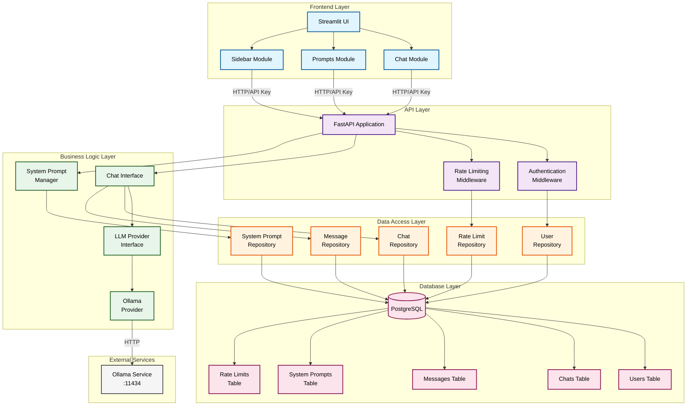

# FastAPI with LLM Provider Integration

A modern FastAPI application with PostgreSQL database integration, multiple endpoints including LLM capabilities with pluggable provider support, and a user-friendly Streamlit frontend.


## Project Structure

```
.
├── src/                 # Backend source code
│   ├── main.py          # Main FastAPI application entry point
│   └── utils/           # Utility modules
│       ├── provider/    # LLM provider implementations
│       │   ├── __init__.py
│       │   └── ollama.py # Ollama provider implementation
│       ├── models/       # Data models
│       │   ├── api_models.py # Pydantic models for API
│       │   └── db_models.py  # SQLAlchemy database models
│       ├── repository/  # Database repository pattern
│       │   ├── base.py  # Base repository
│       │   ├── chat_repository.py
│       │   ├── message_repository.py
│       │   ├── system_prompt_repository.py
│       │   ├── user_repository.py
│       │   └── rate_limit_repository.py
│       ├── __init__.py
│       ├── auth.py      # Authentication logic
│       ├── chat_interface_db.py # Database-backed chat interface
│       ├── config.py    # Configuration management
│       ├── database.py  # Database connection and session
│       ├── health.py    # Health check functionality
│       ├── migration.py # Database migration utilities
│       └── system_prompt_db.py # Database-backed system prompt management
├── sql/                 # Database SQL scripts
│   ├── 01_schema.sql    # Database schema definition
│   ├── 02_seed_data.sql # Initial seed data
│   ├── setup.sql        # Master setup script
│   └── docker-init.sh   # Docker initialization script
├── streamlit/           # Streamlit frontend application
│   ├── app.py           # Main Streamlit application
│   ├── modules/         # Modular components
│   │   ├── chat.py      # Chat interface module
│   │   ├── prompts.py   # System prompt management module
│   │   └── sidebar.py   # Sidebar navigation module
│   └── run.sh           # Startup script for Streamlit
├── chats/               # Legacy directory for file-based chat history
├── system_prompts/      # Legacy directory for file-based system prompts
├── requirements.fastapi.txt # Python dependencies for FastAPI backend
├── requirements.streamlit.txt # Python dependencies for Streamlit frontend
├── Dockerfile.fastapi   # Docker configuration for FastAPI backend
├── Dockerfile.streamlit # Docker configuration for Streamlit frontend
├── docker-compose.yml   # Docker Compose for running all services
├── .env.example         # Example environment configuration
└── README.md            # Documentation
```

## Features

- 🚀 **Modern FastAPI Framework**: High-performance, easy to learn, fast to code
- 🐘 **PostgreSQL Database**: Robust relational database for data persistence
- 🔄 **Health Check Endpoint**: Monitor application status
- 🔐 **Database-Backed Authentication**: Secure endpoints with user management and API keys
- 🛡️ **Rate Limiting**: Database-tracked rate limiting per user
- ✅ **Input Validation**: Comprehensive validation of all user inputs
- 🤖 **Pluggable LLM Providers**: Easily switch between different LLM providers
- 💾 **Scalable Data Storage**: PostgreSQL database with proper indexing
- 👥 **Multi-User Support**: Each user has isolated chat sessions
- 🆔 **Custom Chat IDs**: Use your own identifiers for conversation tracking
- 🧵 **Multiple Chat Sessions**: Support for multiple chat threads per user
- 📝 **Customizable System Prompt**: Define LLM behavior with database persistence
- 📚 **System Prompt Library**: Create, edit, and manage multiple system prompts
- 🗑️ **Chat Management**: Delete unwanted conversation histories
- 🖥️ **Streamlit Web UI**: Modern, intuitive user interface with dark mode
- 🧩 **Modular Architecture**: Clean separation of concerns with repository pattern
- 🐳 **Docker Support**: Complete containerization with PostgreSQL included
- 🔄 **Automatic Migration**: Seamless migration from file-based to database storage

## Architecture

The application follows a modular architecture with the following key components:



### Architecture Components:

1. **Database Layer**: PostgreSQL database with SQLAlchemy ORM
   - Users, Chats, Messages, System Prompts, and Rate Limits tables
   - Repository pattern for clean data access
   - Connection pooling for performance
2. **Authentication Layer**: Database-backed user and API key management
   - Support for multiple users with isolated data
   - API key generation and validation
3. **Chat Interface**: Core module that handles chat history management
   - Database persistence for all conversations
   - User isolation and access control
4. **LLM Providers**: Pluggable implementations for different LLM services
   - Currently supports Ollama
   - Designed to easily add other providers like OpenAI, Anthropic, etc.
5. **System Prompt Manager**: Database-backed prompt library
   - Create, update, delete, and activate prompts
   - Per-user prompt customization
6. **API Layer**: FastAPI routes with dependency injection
   - Clean separation of concerns
   - Automatic database session management
7. **Streamlit UI**: Modular frontend with environment configuration
   - Real-time chat interface
   - System prompt management
   - Session navigation

## Requirements

- Python 3.13+
- PostgreSQL 15+
- [Ollama](https://ollama.ai/download) (if using the Ollama provider)
- FastAPI & Uvicorn (backend)
- Streamlit (frontend)

## Installation

### Backend Dependencies

```bash
pip install -r requirements.fastapi.txt
```

### Frontend Dependencies

```bash
pip install -r requirements.streamlit.txt
```

### Configuration

Create a `.env` file in the project root:

```env
# API Security
API_KEY=your-secure-api-key-here

# Rate Limiting
RATE_LIMIT_PER_HOUR=1000

# Database Configuration
DB_HOST=localhost
DB_PORT=5432
DB_NAME=postgres
DB_USER=streamlitdemo
DB_PASSWORD=streamlitdemo

# Legacy File Paths (for migration)
CHAT_HISTORY_DIR=chats
SYSTEM_PROMPT_FILE=system_prompt.txt
SYSTEM_PROMPTS_DIR=system_prompts
```

### Database Setup

1. **Local PostgreSQL Setup**:
   ```bash
   # Create database and user
   createuser -U postgres streamlitdemo
   createdb -U postgres postgres
   
   # Run the schema setup
   psql -U streamlitdemo -d postgres -f sql/setup.sql
   ```

2. **Using Docker** (recommended):
   The PostgreSQL database will be automatically initialized when using docker-compose.

## Setting Up Ollama

1. Install Ollama from [ollama.ai/download](https://ollama.ai/download)
2. Start the Ollama service
3. Pull the required model:
   ```bash
   ollama pull llama3.1:8b-instruct-q8_0
   ```

## Running the Application

### Local Development

#### Backend

```bash
uvicorn src.main:app --reload
```

The API will be available at http://127.0.0.1:8000

#### Frontend

```bash
cd streamlit
chmod +x run.sh
./run.sh
```

The Streamlit UI will be available at http://127.0.0.1:8501

### Using Docker Compose

Docker Compose will automatically start PostgreSQL, FastAPI, and Streamlit:

```bash
# Using .env file (recommended)
docker-compose up

# Or with environment variables
export API_KEY=your-secure-api-key-here
docker-compose up
```

Services will be available at:
- FastAPI backend: http://localhost:8000
- Streamlit frontend: http://localhost:8501
- PostgreSQL database: localhost:5432

The database will be automatically initialized with the schema and seed data on first run.

## API Endpoints

All endpoints except `/` and `/health` require authentication with an API key in the header:
`Authorization: Bearer <API_KEY>`

The application has the following endpoints:

### Root and Health

1. `GET /` - Returns API information and available endpoints (no auth required)
2. `GET /health` - Returns the health status of the API (no auth required)

### Chat Endpoints

3. `POST /chat` - Chat with the LLM using the configured provider
   
   Request:
   ```json
   {
     "message": "Tell me a fun fact about space",
     "chat_id": "optional-chat-id-for-continuing-conversation"
   }
   ```

4. `GET /chat/history` - Get a summary of all chat histories
5. `GET /chat/history/{chat_id}` - Get the complete history for a specific chat
6. `DELETE /chat/delete/{chat_id}` - Delete a specific chat history

### System Prompt Endpoints

7. `GET /system-prompt` - Get the current active system prompt
8. `POST /system-prompt` - Update the active system prompt
   
   Request:
   ```json
   {
     "prompt": "Your new system prompt text"
   }
   ```

9. `GET /system-prompts` - Get all system prompts in the library
10. `POST /system-prompts` - Create a new system prompt
    
    Request:
    ```json
    {
      "name": "Prompt name",
      "content": "Prompt content",
      "description": "Optional description"
    }
    ```

11. `GET /system-prompts/{prompt_id}` - Get a specific system prompt by ID
12. `PUT /system-prompts/{prompt_id}` - Update a specific system prompt
13. `DELETE /system-prompts/{prompt_id}` - Delete a specific system prompt
14. `POST /system-prompts/{prompt_id}/activate` - Set a specific system prompt as the active one

## Using the Chat Endpoint

### Starting a New Conversation

Send a POST request without a chat_id to start a new conversation:

```bash
curl -X POST http://localhost:8000/chat \
  -H "Authorization: Bearer your-api-key-here" \
  -H "Content-Type: application/json" \
  -d '{"message": "Tell me a fun fact about space"}'
```

### Continuing a Conversation

Use the chat_id returned from a previous request to continue the conversation:

```bash
curl -X POST http://localhost:8000/chat \
  -H "Authorization: Bearer your-api-key-here" \
  -H "Content-Type: application/json" \
  -d '{"message": "Tell me more about stars", "chat_id": "space-facts"}'
```

## Managing System Prompts

### Get Active System Prompt

```bash
curl -X GET http://localhost:8000/system-prompt \
  -H "Authorization: Bearer your-api-key-here"
```

### Set Active System Prompt

```bash
curl -X POST http://localhost:8000/system-prompt \
  -H "Authorization: Bearer your-api-key-here" \
  -H "Content-Type: application/json" \
  -d '{"prompt": "You are a helpful assistant..."}'
```

### Create a New System Prompt

```bash
curl -X POST http://localhost:8000/system-prompts \
  -H "Authorization: Bearer your-api-key-here" \
  -H "Content-Type: application/json" \
  -d '{
    "name": "Customer Support",
    "content": "You are a customer support agent...",
    "description": "Prompt for handling customer inquiries"
  }'
```

### Activate a System Prompt from Library

```bash
curl -X POST http://localhost:8000/system-prompts/customer-support/activate \
  -H "Authorization: Bearer your-api-key-here"
```

## Streamlit User Interface

The project includes a modern Streamlit-based web interface organized into modules for better maintainability:

### Features

- **Modular Architecture**: Separated into chat, prompts, and sidebar modules
- **Dark Mode**: Elegant dark theme with customizable appearance
- **Chat Interface**: User-friendly chat interface with message history
- **System Prompt Management**: Create, edit, delete, and activate system prompts
- **Session Management**: Switch between different chat sessions
- **Responsive Design**: Optimized for different screen sizes

### Using the Streamlit UI

1. **Chat Tab**: Main conversation interface
   - Enter session ID (optional) or start without one
   - View conversation history
   - Send messages and receive responses
   - Clear or delete conversations

2. **System Prompts Tab**: Manage LLM behavior
   - View prompt library
   - Create new prompts
   - Edit existing prompts
   - Activate prompts to change AI behavior
   - Delete custom prompts

3. **Sidebar**: Navigation and settings
   - Toggle dark mode
   - Create new chat sessions
   - Switch between existing sessions
   - View and edit active system prompt

## Extending the Application

### Adding New LLM Providers

The system is designed to be easily extended with new LLM providers:

1. Create a new file in the `src/utils/provider/` directory
2. Implement the provider class following the `LLMProvider` protocol
3. Update the import in `src/utils/provider/__init__.py`
4. Change the provider initialization in `src/main.py`

### Extending the Streamlit UI

The modular Streamlit interface can be extended by:

1. Adding new modules in `streamlit/modules/`
2. Implementing new tabs in `app.py`
3. Customizing the appearance through the CSS section

## API Documentation

Interactive API documentation is available at:

- Swagger UI: http://127.0.0.1:8000/docs
- ReDoc: http://127.0.0.1:8000/redoc

## Database Schema

The application uses the following database tables:

- **users**: User accounts with API key management
- **chats**: Chat sessions linked to users
- **messages**: Individual messages within chats
- **system_prompts**: Library of system prompts
- **rate_limits**: Tracking API usage for rate limiting

## Data Migration

The application automatically migrates existing file-based data to PostgreSQL on startup:

1. **System Prompts**: Migrated from `system_prompts/` directory
2. **Chat History**: Migrated from `chats/` directory
3. **Active System Prompt**: Migrated from `system_prompt.txt`

All migrated data is associated with an anonymous user. After migration, users can create accounts for isolated data access.

## Troubleshooting

### Database Connection Issues

If you encounter database connection errors:

1. Verify PostgreSQL is running: `pg_isready -h localhost -p 5432`
2. Check credentials in `.env` file match your PostgreSQL setup
3. Ensure the database exists: `psql -U streamlitdemo -l`
4. For Docker users, check container status: `docker ps`

### Provider Issues

If you encounter Ollama-specific errors:

1. Ensure the Ollama service is running (`ps aux | grep ollama`)
2. Verify you have pulled the required model (`ollama list`)
3. Check for firewall issues blocking access to the Ollama server (port 11434)

### Frontend-Backend Connection

If the Streamlit frontend cannot connect to the FastAPI backend:

1. Verify the API_URL environment variable is set correctly
2. Ensure the backend is running and accessible
3. Check that the API_KEY in `.env` is set for both services
4. Check network connectivity between services if using Docker

### Authentication Errors

If you get 401 Unauthorized errors:

1. Check the API_KEY in your `.env` file
2. Ensure Streamlit has loaded the `.env` file (restart if needed)
3. Verify the Bearer token format in API requests
4. Check if the user's API key exists in the database

## License

This project is licensed under the MIT License - see the LICENSE file for details.

## Acknowledgements

- [FastAPI](https://fastapi.tiangolo.com/) for the high-performance API framework
- [Streamlit](https://streamlit.io/) for the intuitive UI framework
- [Ollama](https://ollama.ai/) for providing local LLM capabilities
